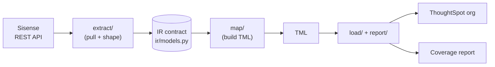
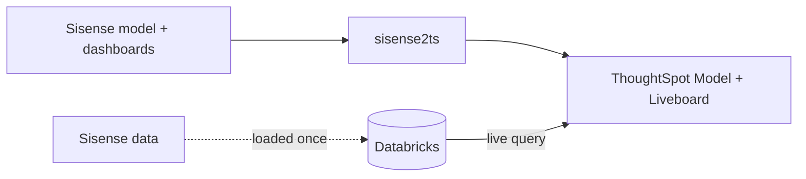

# Architecture

`sisense2ts` converts Sisense BI assets (the data model + dashboards) into ThoughtSpot
**TML**, imports them into a ThoughtSpot org, and produces a **coverage report** of what
converted automatically versus what needs a human. It exists to accelerate Sisense →
ThoughtSpot migrations in Professional Services.

This doc explains how the pieces fit together. For who-builds-what and the git workflow,
see [CONTRIBUTING.md](CONTRIBUTING.md) and [pm/PLAN.md](pm/PLAN.md).

## The pipeline



Four stages, one seam. Everything pulled out of Sisense is normalized **into** a single
intermediate representation (IR); everything that produces ThoughtSpot TML reads **from**
the IR. The two sides never touch each other directly.

## The core idea: a frozen Intermediate Representation

The IR (in [`sisense2ts/ir/models.py`](sisense2ts/ir/models.py)) is the contract in the
middle, and it is the reason this can be built by a small team in parallel:

- **It decouples the work.** Extraction only has to produce valid IR. Mapping only has to
  consume IR. Nobody reads anyone else's code; they agree on the IR shape and move.
- **It lets us build before live data exists.** The IR is plain Python objects, so the team
  develops against fixtures and the same code runs on real Sisense exports later.
- **It is source-neutral.** Today Sisense fills the IR. A Power BI or Tableau extractor
  could fill the *same* IR later, and every line of TML-generation code is reused.

"Frozen" means no silent edits, not never-changes. It evolves through a defined process
(reach for the `raw` escape hatch first, add optional fields additively, make breaking
changes in one coordinated commit). See "Evolving the IR" in CONTRIBUTING.md.

The IR has two halves plus output types:

| Half | Types | Holds |
|---|---|---|
| Semantic (data model) | `SourceModel` → `SourceTable` → `SourceColumn`, joined by `Relation` | tables, columns, types, joins |
| Presentation (dashboards) | `SourceDashboard` → `SourceWidget` → `Field` (+ `Formula`), `SourceFilter`, `TilePosition` | charts, fields, filters, layout |
| Output | `TranslationResult`, `CoverageReport` | per-item AUTO / PARTIAL / MANUAL verdicts |

Every IR object also carries a `raw` dict with the original Sisense JSON, an escape hatch
so a workstream can reach for something the IR does not model yet without a contract change.

## The stages in detail

**1. Extract — `sisense2ts/extract/`**
Pull from Sisense over REST and shape into the IR.
- `sisense_client.py` — REST client (auth, list/export dashboards, export the data model).
- `parse.py` — `parse_datamodel` and `parse_dashboard` turn raw Sisense JSON into IR. The
  real Sisense shapes are documented at the top of this file (e.g. tables live at
  `datasets[].schema.tables[]`; widgets are a separate call; joins are oid triples).
- `sisense_types.py` — Sisense column type codes → IR data types.

**2. IR — `sisense2ts/ir/models.py`** — the frozen contract above.

**3. Map — `sisense2ts/map/`**
Turn IR into ThoughtSpot TML.
- `model.py` — IR semantic layer → **Table** TML (one per table, bound to a Connection) +
  one **Model** TML (joins, columns, formulas).
- `formula.py` — translate the common JAQL/formula subset to TML; flag the rest MANUAL.
- `content.py` — widgets → **Answers**, dashboard → **Liveboard** (chart-type map + layout).

**4. Load + Report — `sisense2ts/load/`, `sisense2ts/report/`**
- `ts_client.py` — import the generated TML via `metadata/tml/import` (validate or apply).
- `report/coverage.py` — render the coverage report.

`cli.py` wires the stages into one command: extract → map → load → report.

## The data-layer truth (read this)

ThoughtSpot queries the cloud warehouse **live**; it does not store the data. Sisense's
ElastiCube **caches** data in its own engine. So the converter migrates the **logical
layer** (model, joins, formulas) and the **presentation layer** (dashboards), **not the
data**. The data must already live in a warehouse ThoughtSpot connects to.



For this project the warehouse is **Databricks**: the Sample ECommerce data is loaded into
`workspace.sisense_demo` (see [sql/databricks_sample_ecommerce.sql](sql/databricks_sample_ecommerce.sql)),
and a ThoughtSpot Connection points at it. The generated Table TML binds to that Connection.

Naming convention the converter applies so TML matches the physical tables: `db_table` =
Sisense table id without the `.csv`; `db_column_name` = Sisense column name with spaces →
underscores (Databricks Delta rejects spaces); the display name keeps the Sisense name.

## Object mapping

| Sisense | IR | ThoughtSpot TML |
|---|---|---|
| datamodel `datasets[].schema.tables[]` | `SourceTable` / `SourceColumn` | `Table` (bound to Connection) |
| `relations[]` (oid triples) | `Relation` / `JoinEndpoint` | joins (with cardinality) inside the `Model` |
| ElastiCube logical model | `SourceModel` | one `Model` |
| JAQL `agg` measure | `Field` (measure) | Model column aggregation |
| JAQL `formula` + `context` | `Field.formula` (`Formula`) | Model `formulas[]` |
| JAQL `filter` (member/range/relative/top-N/exclude) | `SourceFilter` | Model / Answer filter |
| widget (`type`/`subtype` + panels) | `SourceWidget` / `Field` | `Answer` (chart type + columns) |
| dashboard (`.dash` + layout grid) | `SourceDashboard` / `TilePosition` | `Liveboard` (visualizations + tiles) |
| dashboard / widget JS, BloX, plugins | not modelled (kept in `raw`) | not converted — flagged in the coverage report |

## What is automated vs flagged

**Automated:** the data model (tables, columns, types, joins), simple measures, the common
formula functions, member/range/relative/top-N filters, and dashboards mapped coarsely to
Liveboards.

**Flagged MANUAL in the coverage report:** time-intelligence / RANK / measured-value / R
functions, BloX, custom JS, plugins, pixel-perfect layout, and row-level security. The
coverage report is a first-class deliverable: it sets expectations on a PS engagement about
what a consultant must finish by hand.

## The three layers of a Sisense migration (and our scope)

1. **Data / semantic model → TML** — automated.
2. **Dashboards / widgets → TML** — automated, coarse.
3. **Embed integration → ThoughtSpot Visual Embed SDK** — **deferred.** Sisense is
   embedded-first, so for OEM customers the host-app re-platform (SDK swap, auth,
   multi-tenancy, theming) is the real follow-on project. The converter removes the rote
   layers 1–2 so engineering time goes to layer 3.

## Repo layout

```
sisense2ts/
  sisense2ts/
    extract/   # Sisense REST -> raw JSON -> IR
    ir/        # the frozen IR contract (models.py)
    map/       # IR -> Table/Model/Answer/Liveboard TML
    load/      # import TML into ThoughtSpot
    report/    # coverage report
    cli.py     # end-to-end runner
  sql/         # Databricks sample-data DDL + a runner
  tests/       # fixtures + unit tests
  pm/          # plan, task CSV, ClickUp/GitHub helpers
```

## Current status

Extract → IR is implemented and validated against real Sisense trial data; the IR is frozen
(tag `ir-v1`); the Databricks data layer is loaded and a ThoughtSpot Connection is live. The
remaining work is the `map/` stage (Table/Model TML, formula translation, content) and
wiring the end-to-end import.
